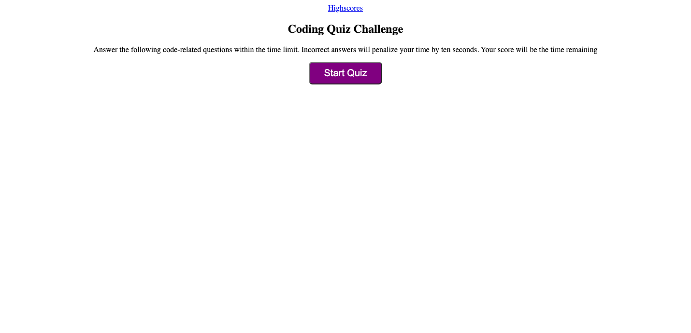
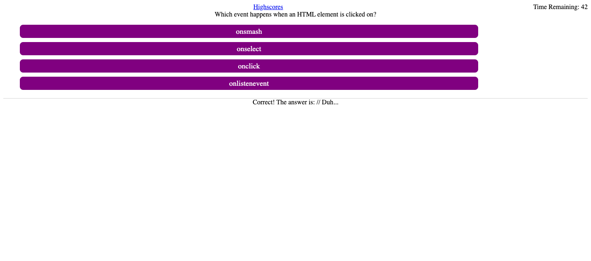
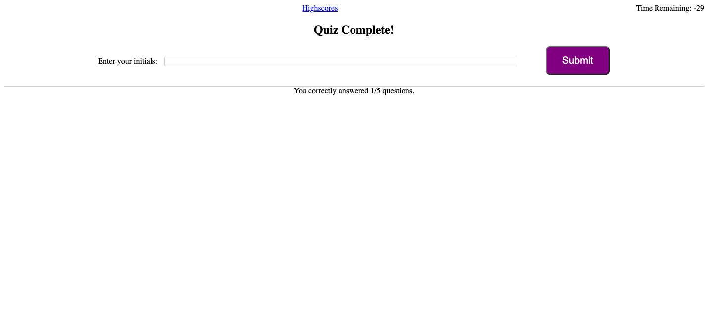
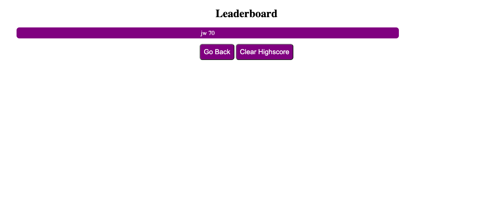

## javascript-quiz-challenge

# Deadline - Dec 19, 2022

# Description
We were given the task of creating a small multiple-question quiz like one we may see in interviews someday. The quiz is timed and will store user scores with given intials. The given user story was:

AS A coding boot camp student 
I WANT to take a timed quiz on JavaScript fundamentals that stores high scores 
SO THAT I can gauge my progress compared to my peers 
 
The acceptance criteria were: 
 
GIVEN I am taking a code quiz 
WHEN I click the start button 
THEN a timer starts and I am presented with a question 
WHEN I answer a question 
THEN I am presented with another question 
WHEN I answer a question incorrectly 
THEN time is subtracted from the clock 
WHEN all questions are answered or the timer reaches 0 
THEN the game is over 
WHEN the game is over 
THEN I can save my initials and my score 

# Site Preview

 
 
 

# Usage
This quiz is limited in scope. It only has five questions. One could create a larger test bank of questions to actually use for studying.

# Links
[Link to GitHub Repositorty for JavaScript Quiz App](https://github.com/jrwesch/javascript-quiz-challenge) 
[Link to GitHub Pages view of website](https://jrwesch.github.io/javascript-quiz-challenge/)

# License
N/A
